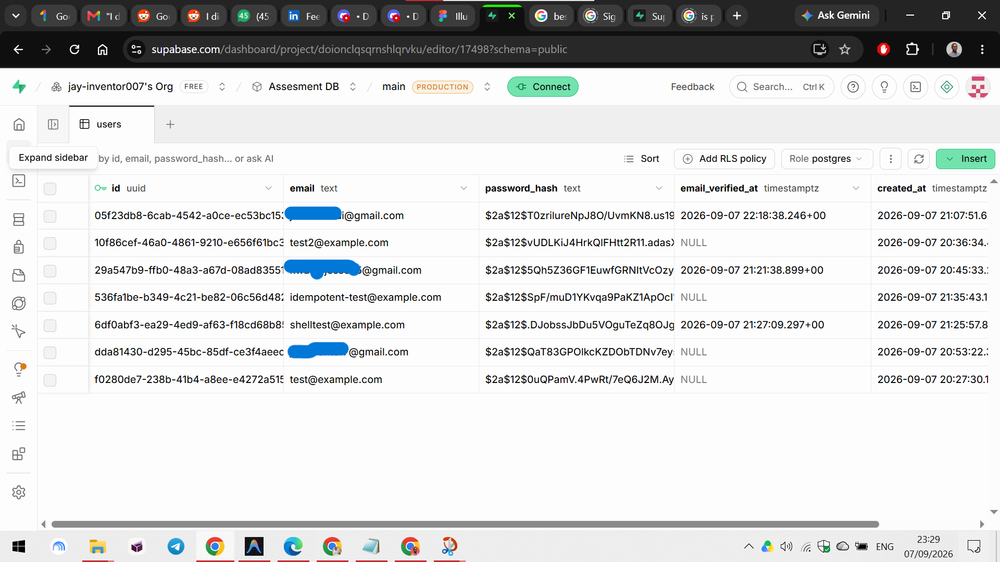
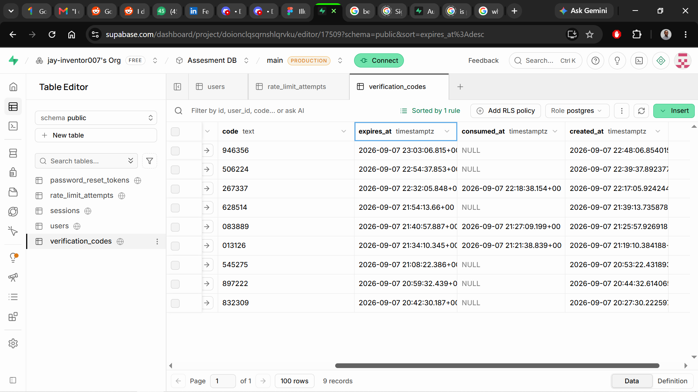

## Section 1: What This Is

This is an authentication slice: a user can create an account, verify it by entering a code sent to their email, and sign in. Once signed in, they land on a placeholder dashboard showing their email and a sign-out button. A signed-in user can sign out, and anyone can reset a forgotten password through an emailed link. If someone who isn't signed in tries to go straight to the dashboard URL, they're redirected to the sign-in page instead of seeing it.

Deliberately left out: no landing page, no dashboard features beyond the placeholder, no profile editing, no account deletion, no social sign-in, and no two-factor authentication. The brief for this assessment explicitly asks for a single working flow rather than a full product, so anything beyond account creation, verification, sign-in/out, and password reset was left out on purpose.

## Section 2: How To Run It

What to install:
- [Node.js](https://nodejs.org) (v20 or later)
- The [Supabase CLI](https://supabase.com/docs/guides/cli) (installed automatically as a project dependency, no separate install needed)

Steps from a fresh clone:

1. `npm install`
2. Copy `.env.example` to `.env` and fill in `VITE_API_BASE_URL`, which is `https://<your-project-ref>.supabase.co/functions/v1`, found in the Supabase dashboard under Project Settings -> General
3. `npx supabase login` (opens a browser to authorize the CLI with your Supabase account)
4. `npx supabase link --project-ref <your-project-ref>` (prompts for your project's database password)
5. `npx supabase db push`, which applies the migrations in `supabase/migrations/` to create the database tables
6. `npx supabase functions deploy`, which deploys all 8 Edge Functions (the backend)
7. Set the email-sending secret: `npx supabase secrets set BREVO_API_KEY=<your-key> EMAIL_FROM=<your-verified-sender>` (get the API key from a [Brevo](https://www.brevo.com) account, under SMTP & API -> API Keys; the sender address must be verified in Brevo under Senders, Domains & Dedicated IPs). Without this step, verification codes and reset links are only visible via the database or Supabase's function logs, not real email.
8. `npm run dev`, which starts the frontend

The app appears at `http://localhost:5173`.

## Section 3: The Flow, Step By Step

**Creating an account.** The user fills in email and password on the sign-up screen (`SignUpPage.tsx`) and submits. The frontend sends that pair to `signup/index.ts`, which checks it isn't being sent too many times in a row (rate limiting), hashes the password so the real password is never stored, saves the new user row, generates a random 6-digit code, saves that code with an expiry time, and emails it. The user is then sent to the verification screen.

Evidence of hitting this endpoint directly with curl, bypassing the browser entirely:

```
curl.exe -i -X POST "https://<project-ref>.supabase.co/functions/v1/signup" -H "Content-Type: application/json" -d "{\"email\":\"docs-evidence@example.com\",\"password\":\"EvidencePassword123\"}"

HTTP/1.1 201 Created
Content-Type: application/json

{"email":"docs-evidence@example.com"}
```

**Verifying the email.** The user types the 6-digit code into `VerifyEmailPage.tsx`. This gets sent to `verify-email/index.ts`, which checks the code matches, hasn't expired, and hasn't already been used. If it's valid, the server marks the user as verified and starts a session (a signed-in browser cookie), and the user lands on the dashboard. If the code doesn't arrive, the resend button calls `resend-verification/index.ts`, which sends a new code, but only once every 60 seconds, enforced by the server, not just by disabling the button in the browser.

**The dashboard.** `DashboardPage.tsx` is wrapped in `ProtectedRoute.tsx`, which calls `me/index.ts` to check whether the browser's cookie matches a real, unexpired session before showing anything. If someone who isn't signed in tries to go straight to the dashboard URL, this check fails and they're redirected to the sign-in screen instead.

**Signing out.** The dashboard's sign-out button calls `signout/index.ts`, which deletes the session from the database and clears the cookie, so that cookie can never be used again even if someone had a copy of it.

**Signing back in.** `SignInPage.tsx` sends the email and password to `signin/index.ts`, which checks the password against the stored hash and, if it matches and the account is verified, starts a new session the same way verify-email does.

**Forgetting a password.** `ForgotPasswordPage.tsx` sends just the email to `forgot-password/index.ts`. If an account exists for that email, it generates a one-time link and emails it. Clicking that link opens `ResetPasswordPage.tsx` with a token in the URL. Submitting a new password there sends it to `reset-password/index.ts`, which checks the token is valid, unused, and not expired, saves the new password, and signs the user out of every device they were previously signed in on, not just the one they're resetting from.

## Section 4: The Data Model

**`users`**: one row per account. `email` is `unique` and `not null`, so no two accounts can ever share an email, and every account has one. `password_hash` is `not null` and stores a bcrypt hash, never the real password. `email_verified_at` is nullable, empty until the user verifies, filled in once they do, which is also how the app checks whether an account is allowed to sign in yet.

**`verification_codes`**: one row per 6-digit code generated. `user_id` is a foreign key to `users`. The `code` is stored as plain text on purpose, not hashed, unlike sessions and reset tokens below. A 6-digit code is short-lived (15 minutes) and low-value on its own, so the real protection is the rate limit on guessing it, not hiding it in the database.

**`password_reset_tokens`**: one row per reset link generated. Stores `token_hash`, not the raw token, because a reset token is high-entropy and, unlike a 6-digit code, would let someone reset the account instantly if a database leak exposed it in plain form. The real token only ever exists in the emailed link.

**`sessions`**: one row per signed-in browser. Same reasoning as reset tokens: `token_hash` is stored, not the raw cookie value, so that reading the database doesn't hand someone a working session they can use to sign in as that user.

**`rate_limit_attempts`**: one row per attempt on a rate-limited action, logging the `route`, the `identifier` (IP or email depending on the route), and when it happened.

**Which constraints make an invalid state impossible?** The `unique` constraint on `users.email` makes it impossible for two accounts to ever exist for the same address. Even if a bug let two signup requests for the same email both try to insert at once, Postgres rejects the second one outright. The `foreign key` on `user_id` (on `sessions`, `verification_codes`, and `password_reset_tokens`) makes it impossible for any of these rows to exist without pointing to a real, existing user. An insert for a nonexistent user is rejected, and `on delete cascade` means deleting a user automatically deletes all their sessions, codes, and tokens too, so nothing is ever left pointing at an account that no longer exists.

## Section 5: The Concepts

### Password Hashing

**What it is.** Password hashing takes a password and runs it through a one-way process that turns it into a scrambled, fixed-length string that cannot be reversed back into the original, unlike encryption, which can be undone with the right key. When someone signs up, only this scrambled version is stored, never the real password. When they sign in, the app hashes what they just typed and checks whether it matches the stored version, so the app never needs to know or store the actual password to confirm it's correct.

**Why it is needed.** If the database were ever read by someone who shouldn't have access to it, plaintext passwords would let that person sign in to every account immediately. And because people commonly reuse passwords across different sites, it would likely hand them access to those users' accounts elsewhere too, not just this app.

**How I implemented it.** Bcrypt with a cost factor of 12, in `supabase/functions/_shared/password.ts`. The hash is generated at signup and on password reset, and compared at signin:
```ts
const COST_FACTOR = 12;
export function hashPassword(password: string): Promise<string> {
  return bcrypt.hash(password, COST_FACTOR);
}
export function verifyPassword(password: string, hash: string | null): Promise<boolean> {
  return bcrypt.compare(password, hash ?? DUMMY_HASH);
}
```
Signin always runs a bcrypt comparison, even if no account exists for the email typed in, comparing against a fake pre-made `DUMMY_HASH` instead of skipping the check. Without this, a real account would take slightly longer to reject a wrong password than a nonexistent one would, and that tiny timing difference could be used to figure out which emails have accounts on the app.

Evidence the password is genuinely hashed, never stored in plain text:



**What I chose against, and why.** The standard `bcrypt` npm package most tutorials use relies on native compiled code, which doesn't run in Supabase Edge Functions since they execute in a sandboxed Deno environment with no support for native binary addons. `bcryptjs`, a pure JavaScript implementation of the same algorithm, was used instead specifically because it has to run in that environment, not because of a general preference.

### Rate Limiting

**What it is.** Rate limiting caps how many times an action can be attempted in a given time window, for example, only 10 sign-in attempts per 5 minutes from the same source. Once the cap is hit, further attempts are rejected until enough time has passed for old attempts to age out of the window.

**Why it is needed.** Without it, someone could try thousands of password guesses per minute against one account, or spam the signup or password-reset endpoints, and every single attempt would still cost a real database query, with nothing stopping the attack from just running faster.

**How I implemented it.** A single Postgres function, `check_rate_limit`, in `supabase/migrations/20260907120001_rate_limiting.sql`, shared by every rate-limited route (signup, signin, forgot-password, resend-verification, verify-email, reset-password) instead of duplicating the logic per route. It counts attempts logged in an append-only `rate_limit_attempts` table within the trailing time window, and uses `pg_advisory_xact_lock` to stop two requests arriving at the exact same instant from both slipping through before either one's attempt is counted.

**What I chose against, and why.** A simpler fixed time window was used instead of a more precise sliding window. It just counts how many attempts happened in the last N seconds, which is easy to reason about and matches the attempts log directly, even if it's a little less exact right at the edge of the window.

Evidence of the limit triggering, 10 wrong-password sign-in attempts in a row against the same account, then an 11th:

```
Attempt 1 : 401
Attempt 2 : 401
Attempt 3 : 401
Attempt 4 : 401
Attempt 5 : 401
Attempt 6 : 401
Attempt 7 : 401
Attempt 8 : 401
Attempt 9 : 401
Attempt 10 : 401
Attempt 11 : 429
```

Full response for the rejected attempt, showing the real `Retry-After` header:

```
HTTP/1.1 429 Too Many Requests
Retry-After: 63
Content-Type: application/json

{"error":"Too many attempts. Try again later."}
```

### Client-Side Versus Server-Side Validation

**What it is.** Client-side validation checks input in the browser before it's sent, giving instant feedback without waiting on the network. Server-side validation checks the exact same rules again once the request arrives at the server, regardless of what sent it.

**Why it is needed.** Client-side checks can be skipped entirely, since anyone can call the API directly instead of using the browser form. I proved this myself: sending a 5-character password straight to the signup endpoint with curl, bypassing the website completely, still got rejected with `400 Bad Request` and the exact same "Password must be at least 10 characters" message the browser would have shown. If only the browser checked this, that request would have gone straight into the database with a weak password.

```
curl.exe -i -X POST "https://<project-ref>.supabase.co/functions/v1/signup" -H "Content-Type: application/json" -d "{\"email\":\"bypass-test@example.com\",\"password\":\"short\"}"

HTTP/1.1 400 Bad Request
Content-Type: application/json

{"error":"Invalid input","issues":{"formErrors":[],"fieldErrors":{"password":["Password must be at least 10 characters"]}}}
```

**How I implemented it.** One shared file, `shared/validation.ts`, holding Zod schemas for every form. Both the React frontend (for instant inline errors) and every Edge Function (which calls `.safeParse()` on the incoming request body and returns 400 on failure) import from this exact same file, not two separate copies of similar rules.

**What I chose against, and why.** Writing the validation rules twice, once for the frontend and once for the backend, was the obvious alternative, and it's what most tutorials do. It was rejected because two copies of the same rules can drift out of sync over time; a change made to one and forgotten in the other creates a real gap silently.

### Session Management

**What it is.** After a successful signin or verification, the server creates a record that says "this specific browser is signed in as this specific user," and gives the browser a token (stored in a cookie) to prove that on every future request. Without this, the server would have no memory between one request and the next, since each request normally arrives with no idea what happened before it.

**Why it is needed.** Without sessions, the dashboard would have no way to know who's asking to see it, or whether the request came from someone who actually signed in at all. Every single page would need the user to somehow re-prove their identity from scratch.

**How I implemented it.** A `sessions` table in the database keeps one row per signed-in browser: a hashed version of a secret token (hashed with SHA-256, meaning scrambled in a one-way way, same idea as password hashing), which user it belongs to, and when it expires. This lives in `supabase/functions/_shared/cookies.ts` and the `signin`/`verify-email` functions. When someone signs in successfully, the server creates a random secret token, saves its hash in the database, and sends the real token to the browser as a cookie with three specific settings: `HttpOnly` (the website's own JavaScript can't read it), `Secure` (only sent over HTTPS), and `SameSite=Lax` (not sent along with certain cross-site requests), plus a 7-day expiry. Every time the dashboard loads, the server hashes the cookie the browser sent and checks whether it matches a real, still-valid session.

**What I chose against, and why.** The alternative was a JWT (JSON Web Token), a type of token that carries all its information inside itself, so the server never has to check a database to know it's valid. This was rejected because a JWT stays valid until it simply expires; there's no easy way to cancel one early. Storing sessions in the database instead means a session can be shut down immediately just by deleting its row, which matters here: signing out and resetting a password both need to end a session right away, not wait for it to expire on its own.

### Token And Code Expiry

**What it is.** Every verification code and password reset link has a limited lifetime. After that time passes, it stops working even if it was never used.

**Why it is needed.** Without expiry, an old code or link would work forever. If an old email got found or leaked long after it was sent, a permanently valid code would still let someone into the account with no time limit on the risk at all.

**How I implemented it.** An `expires_at` column on `verification_codes` and `password_reset_tokens`, set the moment the row is created (15 minutes ahead for codes, 30 minutes for reset tokens). Every lookup checks `expires_at` is still in the future; an expired row is never treated as valid, even though it's still sitting in the table. I tested this directly: I signed up, took a screenshot of the code and its `expires_at`, waited past that time, then tried to verify with that exact same code and got `400 Invalid or expired code` back.

The code, live in the database right after signup, not yet expired:



The same code rejected once that time passed:

```
curl.exe -i -X POST "https://<project-ref>.supabase.co/functions/v1/verify-email" -H "Content-Type: application/json" -d "{\"email\":\"expiry-evidence@example.com\",\"code\":\"946356\"}"

HTTP/1.1 400 Bad Request
Content-Type: application/json

{"error":"Invalid or expired code"}
```

**What I chose against, and why.** Just showing a countdown timer in the browser and disabling the input once it hits zero was the tempting shortcut, and plenty of apps only do that. It was rejected because a countdown is just decoration if the server doesn't also check it: someone could still submit the old code directly to the server (skipping the browser entirely, the same way I tested signup with curl) after the visual timer ran out, and it would still work.

### Idempotency

**What it is.** An idempotent action produces the same end result no matter how many times it's repeated. Doing it twice has the same effect as doing it once, nothing extra happens the second time.

**Why it is needed.** Without it, a double form submission (a double-click, or a slow network causing the browser to quietly retry) could create two separate accounts for the same person instead of one, leading to confusing duplicate data.

**How I implemented it.** Signup first checks whether a user already exists for that email. If one does and isn't verified yet, it updates that same row instead of inserting a new one. To handle two requests arriving at the exact same instant (a real race, not just a slow double-click), the insert is wrapped so that if it fails because the email already exists, meaning the database's own unique constraint caught it, the code falls back to that same update path instead of crashing. I proved this directly: fired two signup requests for the same email at the exact same time, both came back `201`, and checked the database afterward to confirm exactly one account existed.

**What I chose against, and why.** Relying only on the frontend disabling the submit button after one click was the simpler option. It was rejected as the only protection because a network retry or a genuine race between two nearly-simultaneous requests can still happen even with a disabled button on one browser tab, so real protection had to exist on the server, not just the browser.

### Database Constraints As A Last Line Of Defence

**What it is.** A database constraint is a rule the database itself enforces on every write, no matter what the application code does, things like "this column can never be empty," "this value must be unique across the whole table," or "this reference must point to a row that actually exists."

**Why it is needed.** Application code can have bugs, or a new feature added later can simply forget a rule that used to be checked somewhere else. If the only thing stopping two accounts from sharing an email is a check written in the signup code, any gap in that code lets it through. A constraint enforced by the database itself catches the problem no matter which code path tried to break the rule, including ones that don't exist yet.

**How I implemented it.** The `unique` constraint on `users.email`, `foreign key` constraints linking `sessions`, `verification_codes`, and `password_reset_tokens` to `users.id` (with `on delete cascade`), and `not null` on required fields like `password_hash`. This isn't just theoretical: the unique constraint is literally what caught the concurrent double-signup case, when two signups for the same email arrived at the same instant, the database's own constraint is what turned the second insert into a "this already exists" response instead of a silent duplicate.

**What I chose against, and why.** Relying only on "check if it exists first, then decide whether to insert" application logic was the natural first instinct, and it's still used as the normal path. It's not relied on alone, though, because that check-then-act pattern has a real gap: two requests can both check at nearly the same moment, both see "doesn't exist yet," and both try to insert, before either one has actually written anything. Only a rule enforced by the database itself closes that gap completely.

### Protected Routes

**What it is.** A protected route is a page or API endpoint that only responds to someone who is actually signed in. Anyone else gets redirected or rejected instead of seeing it.

**Why it is needed.** Without this check, anyone could just type the dashboard's URL directly into their browser and see it, even without ever signing in, which would defeat the entire point of having accounts.

**How I implemented it.** Two layers. On the frontend, `ProtectedRoute.tsx` wraps `DashboardPage.tsx` and calls `/me` as soon as the page loads; if that comes back `401`, it redirects to the sign-in page instead of rendering anything. But the real protection is on the backend: `/me` reads the session cookie, hashes it, and looks it up in the `sessions` table, and returns `401` if there's no valid match, regardless of what the frontend does or asks for. I tested this directly by calling `/me` with no cookie at all and getting `401` back.

**What I chose against, and why.** Relying only on the frontend redirect, hiding the dashboard component if the user isn't logged in, without a real backend check, was the tempting shortcut. It was rejected because hiding a screen only hides it visually; the actual data shown on that screen (the signed-in user's email) still has to come from somewhere. If the backend didn't independently verify the session on every request for that data, someone could just call the API directly, the same way I tested with curl throughout this session, and get the data without ever going through the frontend's gate at all.

## Section 6: What Went Wrong

**Problem 1: signup returned 401 before I'd changed anything.**

The symptom: the very first time I tested the signup endpoint directly with curl, bypassing the browser entirely, it came back `401 Unauthorized` with `"code":"UNAUTHORIZED_NO_AUTH_HEADER"`. This was confusing because nothing in my own signup code checks for an authorization header at all, so the error clearly wasn't coming from anything I'd written.

The investigation: I worked through this with the AI agent I was building the backend with. We looked at the response headers together and confirmed the rejection was coming from Supabase's own platform, not from our function's code, since our code never even ran.

The cause: Supabase puts every deployed Edge Function behind a check that requires a valid Supabase-issued login token by default, before the request reaches the function at all. My app doesn't use Supabase's own login system though, it has its own separate session-cookie system, so every request looked unauthenticated to that check even for actions like signing up that shouldn't need to be signed in yet.

The fix: added `verify_jwt = false` for every one of my functions in `supabase/config.toml`, and redeployed. After that, signup worked as expected.

**Problem 2: signup and resend-verification kept returning success, but no email ever arrived.**

The symptom: after switching to sending real emails through Brevo's SMTP relay, every signup and resend request came back with a normal success response, no errors at all, but nothing ever showed up in my inbox, not even in spam.

The investigation: I checked Brevo's own dashboard under Transactional Logs and found zero log entries for any of my test emails, meaning Brevo had never even received the requests. That ruled out a delivery problem on Brevo's side and pointed back at my own setup. With the agent's help, I temporarily deployed a small diagnostic function that reported whether each expected secret (`SMTP_HOST`, `SMTP_USERNAME`, `SMTP_PASSWORD`, `EMAIL_FROM`) was actually present and how long its value was, without printing the actual values.

The cause: `SMTP_USERNAME` was set, but to an empty string, from a command that got cut off while I was setting the secrets. An empty string is treated as "not set" by the code's check, so the app was silently falling into its safe fallback path (just logging the email instead of sending it) instead of throwing any error.

The fix: re-set `SMTP_USERNAME` correctly as a single command, confirmed with the diagnostic function that it now had a real value, and removed the diagnostic function afterward.

**Problem 3: after fixing the username, sending still failed, this time with a 503 and no useful error.**

The symptom: with all four SMTP secrets finally correct, sending an email came back as `503 Service Unavailable` with an empty body.

The investigation: comparing response headers between this failing request and every other request throughout testing, even ones that returned expected errors like a `400` or `401` from my own validation code, those all showed `x-served-by: supabase-edge-runtime`, meaning my function's own code had actually run and produced the response. This failing one showed `x-served-by: base/server` instead, meaning Supabase's own platform had rejected it before my function ever started running.

The cause: Supabase Edge Functions run in a sandboxed environment that isn't built to make raw outbound SMTP (or general TCP) connections the way a normal server can, only regular HTTPS requests.

The fix: rewrote the email-sending code to call Brevo's HTTP API instead (a single HTTPS request, no SMTP connection involved), keeping the same Brevo account, just a different way of talking to it. This worked immediately and has been reliable since.

## Section 7: What This Slice Does Not Handle

Ran out of time / accepted gaps, not deliberately out of scope:
- No automated test suite. Everything in this document was verified manually, by hand, with curl and by walking through the actual screens, not by automated tests that would catch a regression later.
- Old rows in `rate_limit_attempts`, expired `verification_codes`, and expired `password_reset_tokens` are never cleaned up. The tables will just grow forever; a real deployment would need a scheduled job to delete old rows.
- If Brevo accepts an email for sending but then fails to actually deliver it later (a bad address, a bounce, etc.), this app never finds out. There's no webhook set up to listen for delivery failures.
- There's no way for a user to see or manage their own active sessions (e.g. "sign out of all other devices"), even though the backend could support it since sessions are just rows in a table.

Left out on purpose, because the brief explicitly asked for a single flow, not a full product:
- No landing page, no dashboard beyond the placeholder, no profile editing, no account deletion, no social sign-in, no two-factor authentication.

What breaks at scale: the `rate_limit_attempts` table grows without bound (see above), and every rate-limited route currently allows a fairly generous limit tuned for testing, not for a real attacker; those numbers would need tightening and probably per-account tracking in addition to per-IP for a real deployment.

## Section 8: If I Built This Again

The biggest thing I'd do differently is check what a hosting platform actually supports before building around an assumption. I built the entire email-sending feature around a real SMTP connection, wrote the code, set up the credentials, and only discovered Supabase Edge Functions don't reliably support raw outbound SMTP once I actually tried to send something for real. If I'd checked that constraint first, I would have gone straight to Brevo's HTTP API and skipped an entire round of debugging that had nothing to do with my own code being wrong.
